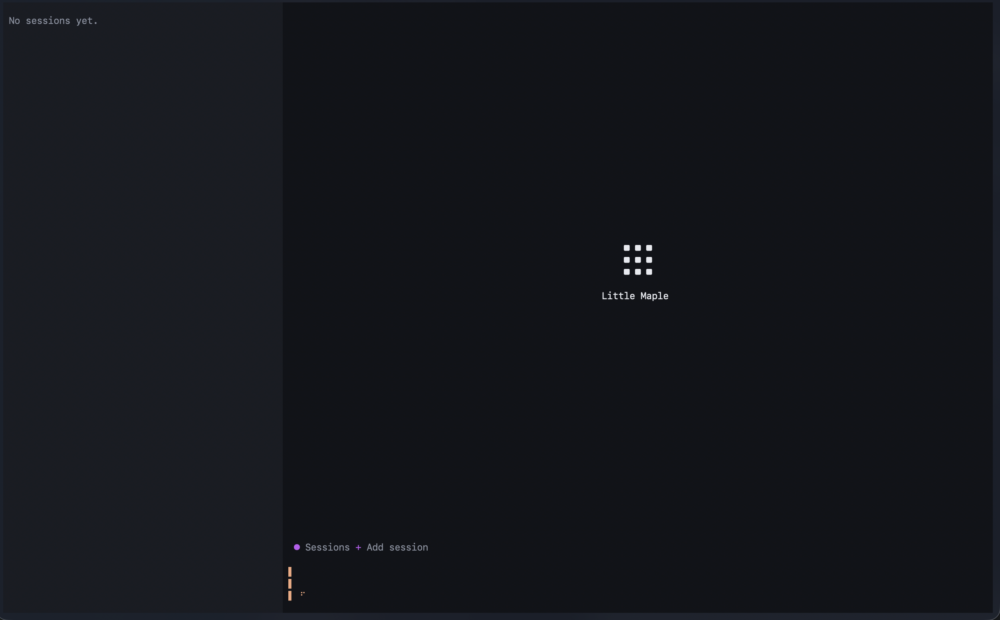
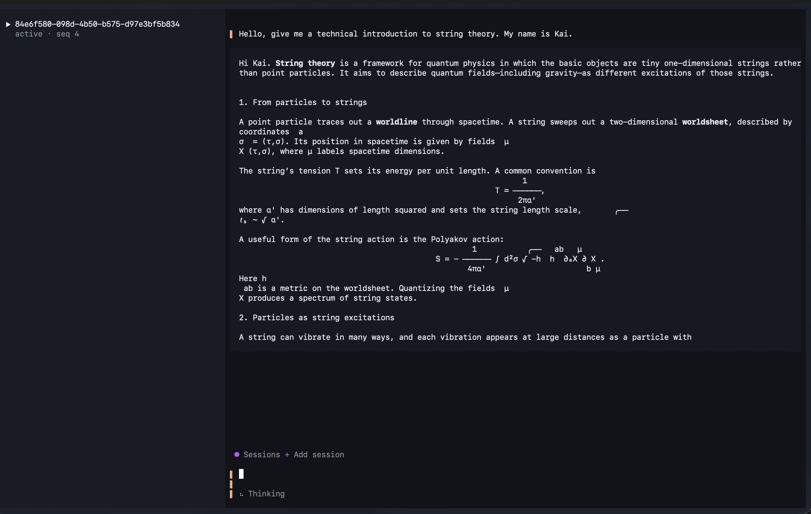
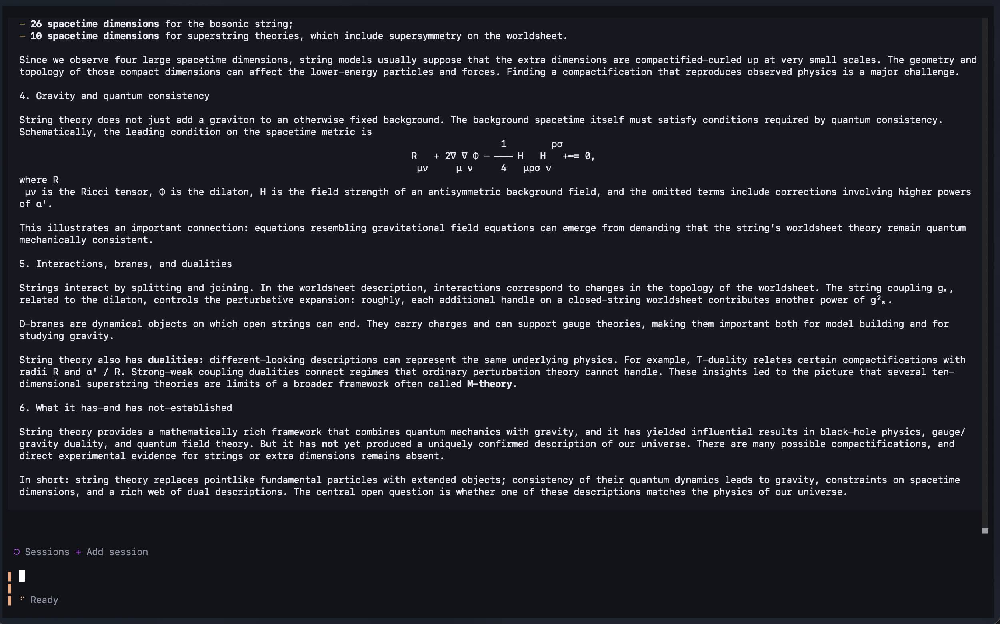
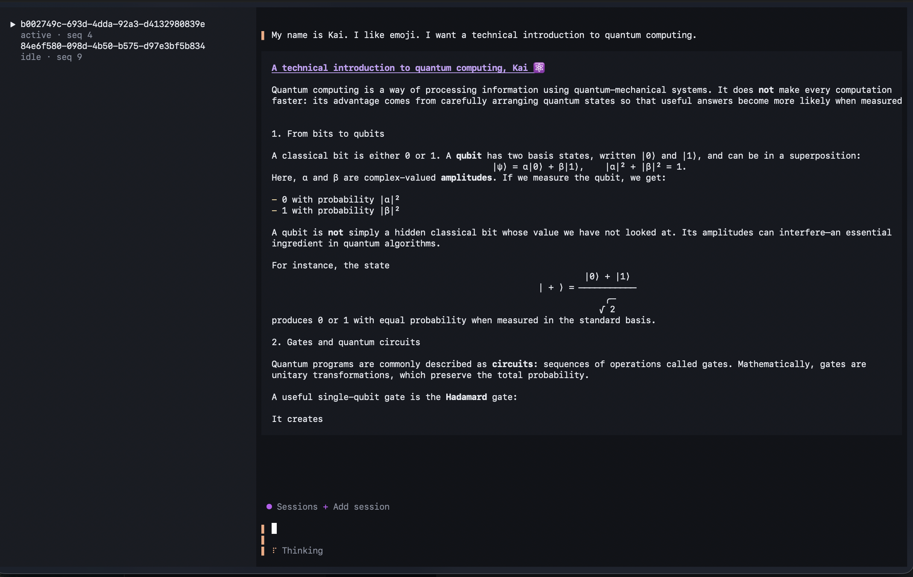

# Little Maple

Little Maple is a minimal, hackable harness for experimenting with coding agents. It records a Turn's `Provider`, `Tool`, `Location`, and `ToolCallRule` selections as one contract. Every model call in that Turn uses the same contract, and the Session journals the calls and their outcomes. The current app runs the Harness in a local daemon with SQLite and an OpenTUI client; its default Provider uses OpenAI Responses.

[Website](https://little-maple.tnspacetime.com)

## Design

**Location is a service the Turn selects.** Many coding-agent loops attach a working directory to the Session and let every repository Tool inherit it. Little Maple records a `Location` alongside its `Provider` and `Tool` choices. A later Turn can select another Location; a branch can make a different choice without changing its parent. Starting the daemon inside a repository grants no access by itself.

**Tool selection and Tool authority are separate.** Selecting a `Tool` makes it available to the model. Selected `ToolCallRule` policies inspect each requested call before execution; they can reject it or narrow which selected Locations the Tool receives. `Tool.execute()` gets that restricted resource view, rather than the whole registry or the daemon's working directory.

**The Turn has the contract; a Step is one real model invocation.** The Session journals a description of its selected services: kind, key, revision, settings, and order. At Turn start, the Harness resolves that description against live Plugin registrations and holds the result through every Step and Tool call. It does not define a separate Step specification. Each `Provider.stream()` call is a Step whose request is derived from recorded prompts, accepted output, Tool results, and the frozen Turn configuration. A service change applies to the next Turn. If a recorded service no longer matches a live implementation after restart, resolution fails explicitly.

**Branches inherit the facts, not only the transcript.** A branch reads an exact prefix of its parent's journal, including service selections, Provider output, Tool decisions, and results, then writes its own suffix. Later changes in the parent do not enter the branch.

**The projector guards the journal.** `projectSessionFact()` checks each candidate fact against the current Session state before it can be appended: for example, a Tool cannot settle before it is committed, and a new Step cannot start while another Step is active. The store writes the accepted fact and its projection together. The same rules replay a branch's inherited prefix. A committed Provider or Tool invocation with no recorded outcome requires explicit recovery; the Harness does not silently run it again.

The daemon exposes authenticated local commands and live events. SQLite facts and projections are the source of truth; the TUI is a client of that state.

## Screenshots

**Empty state**



**Streaming response**



**Conversation detail**



**Multiple sessions**



## Run

Requires Node.js 22 or later and Bun 1.x.

```bash
bun install
cp .env.example .env
# Add your OPENAI_API_KEY to .env
npm run daemon
```

In another terminal:

```bash
npm run tui
```

Type a prompt and press Enter to create a Session and send it in one step. **Add session** still creates an empty Session. Use `Ctrl+J` for a newline. `Tab` moves focus, `Ctrl+R` refreshes the Session list, and `Ctrl+C` closes the TUI. `Ctrl+U` resumes a paused Session. Closing the TUI does not stop the daemon.

The supplied `.env.example` selects `gpt-6-luna`; without `OPENAI_MODEL`, the daemon falls back to `gpt-5.6-luna`. `OPENAI_BASE_URL` can point the Responses adapter at a compatible endpoint.

### Local database

Sessions are stored in `~/.little-maple/harness.sqlite` by default. SQLite may also create `harness.sqlite-wal` and `harness.sqlite-shm` in the same directory. To clear local Sessions, stop the daemon and remove those three files; the next start creates a fresh database. Set `LITTLE_MAPLE_STATE_DIR` to move the state directory, or `LITTLE_MAPLE_DATABASE` to choose a different SQLite file.

## Current scope

The daemon currently installs the OpenAI Responses `Provider`. New Sessions select that Provider but no repository `Location`, `Tool`, or `ToolCallRule`. The Harness supports those service kinds and branching; the daemon API exposes branches. Repository selection and branch creation are not yet available in the TUI.

After a daemon restart, queued or active work stays paused until explicitly resumed. A committed Provider or Tool invocation with no recorded outcome is shown as requiring recovery and is not silently retried.

## Development

```bash
npm run check
```

This runs the TypeScript check.

Little Maple is licensed under [MIT](LICENSE).
